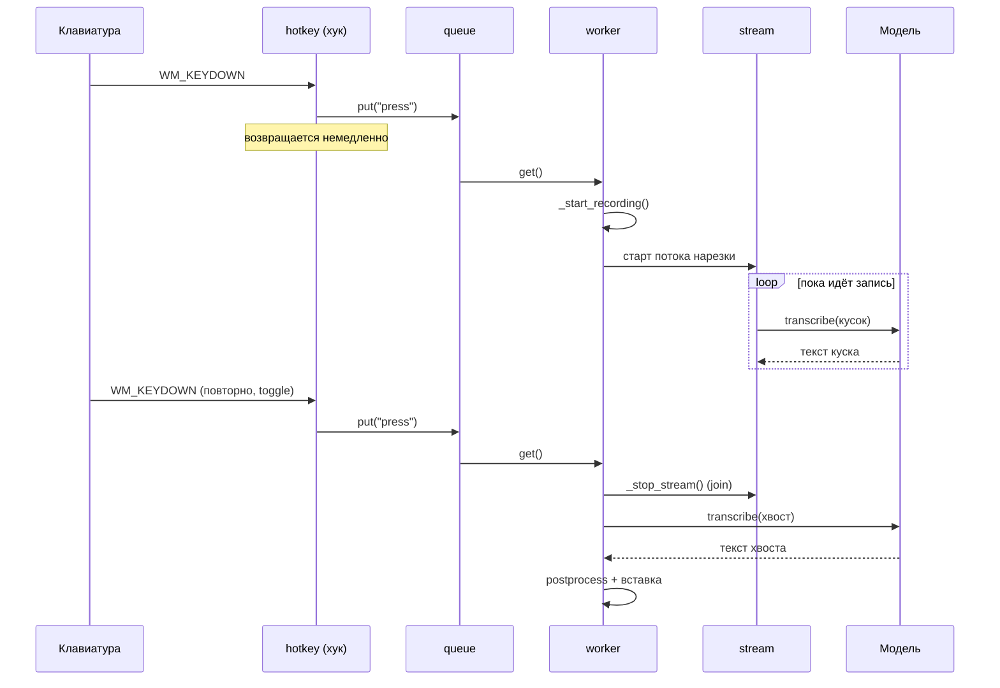

# 02. Архитектура

## Форма системы

Это **однопроцессное многопоточное десктопное приложение без сети и без БД**. Нет клиента и
сервера, нет очередей, нет внешних сервисов. Всё состояние живёт в памяти процесса; на диск
попадают только конфиг, история фраз, логи и скачанная модель.

Ядро — класс `App` ([app.py](../whispertype/app.py)), который владеет всеми подсистемами и
крутит state machine записи. Подсистемы между собой напрямую не общаются: они складывают
события в очередь, а `App` их разбирает.

## Карта модулей

```
launcher.py ──► whispertype.app.main()
                     │
                     ├── config.py      загрузка/валидация config.json, пути
                     ├── logging_setup  RotatingFileHandler
                     ├── winutil.py     single instance (mutex), MessageBox
                     │
                     └── App ────────────────────────────────────────────┐
                          │                                              │
      ┌───────────────────┼───────────────────┬──────────────┬───────────┤
      ▼                   ▼                   ▼              ▼           ▼
  HotkeyListener     AudioRecorder      Transcriber       Tray       Overlay
  (hotkey.py)        (audio.py)         (stt.py)        (tray.py)  (overlay.py)
      │                   │                   │              │           │
   keys.py            sounddevice       faster_whisper    pystray     WinAPI
  (парсинг                             + textproc.py                 layered
   комбинаций)                         (постобработка)                window
                                                                          
      Вспомогательные: inject.py (вставка текста), history.py (последние
      фразы), sounds.py (сигналы), autostart.py (реестр)
```

## Модель потоков

Это самая важная часть архитектуры: почти каждая подсистема живёт на своём потоке, потому что
WinAPI требует message loop, а инференс блокирует надолго.

| Поток | Кто создаёт | Что делает | Почему отдельный |
|---|---|---|---|
| **main** | процесс | `pystray.Icon.run()` — цикл сообщений трея | pystray требует главный поток |
| **hotkey** | `HotkeyListener` ([hotkey.py:134](../whispertype/hotkey.py)) | `SetWindowsHookExW` + `GetMessageW` | хук обязан иметь свой message loop; коллбэк должен возвращаться мгновенно |
| **overlay** | `Overlay` ([overlay.py:324](../whispertype/overlay.py)) | окно индикатора + message loop | своё окно = свой цикл сообщений |
| **worker** | `App._init` ([app.py:103](../whispertype/app.py)) | разбирает очередь событий, ведёт запись и распознавание | инференс блокирует на секунды — нельзя в потоке хука или трея |
| **stream** | `App._start_recording` | дораспознаёт куски во время записи | работает параллельно с продолжающейся записью |
| **foreground** | `App._init` ([app.py:105](../whispertype/app.py)) | раз в 0.2 с запоминает активное чужое окно | нужен постоянный опрос, независимый от событий |
| **audio-watchdog** | `AudioRecorder.start` ([audio.py:91](../whispertype/audio.py)) | раз в 3 с переоткрывает умерший аудиопоток | восстановление после смены/отключения микрофона |
| **аудио-callback** | PortAudio | складывает блоки в буфер | вызывается драйвером, обязан быть мгновенным |
| **beep** | `Sounds._play` | короткий сигнал | `winsound.Beep` блокирует на длительность звука |
| **setup** | pystray | однократная инициализация после создания иконки | pystray вызывает `setup` в отдельном потоке |

### Как потоки связаны

Единственный канал управления — **`queue.Queue[str]`** (`App._events`). Хук и таймер лимита
записи кладут туда строки (`"press"`, `"release"`, `"cancel"`, `"limit"`, `"hook_failed"`),
worker их вынимает. Это осознанное решение: хук-коллбэк выполняется внутри системного вызова
Windows, и если он задержится, ОС снимет хук и клавиатура начнёт лагать
([hotkey.py:1-5](../whispertype/hotkey.py) — об этом сказано прямо в docstring).



### Синхронизация

| Замок | Что защищает | Где |
|---|---|---|
| `AudioRecorder._lock` | список аудио-блоков и счётчики | [audio.py:79](../whispertype/audio.py) |
| `AudioRecorder._open_lock` | переоткрытие устройства (watchdog vs пользователь) | [audio.py:80](../whispertype/audio.py) |
| `Transcriber._lock` | сам инференс | [stt.py:111](../whispertype/stt.py) |
| `PhraseHistory._lock` | список фраз (пишет worker, читает трей) | [history.py:27](../whispertype/history.py) |
| `App._shutdown` (Event) | сигнал завершения фоновых циклов | [app.py:54](../whispertype/app.py) |
| `App._stream_stop` (Event) | остановка потока нарезки | [app.py:70](../whispertype/app.py) |

**`Transcriber._lock` важен не только из-за потокобезопасности модели.** Сужение окна энкодера
реализовано подменой глобальной функции библиотеки (`faster_whisper.transcribe.pad_or_trim`),
поэтому два одновременных распознавания перетёрли бы патч друг друга — см.
[06-speed.md](06-speed.md#сужение-окна-энкодера).

Последствие: поток `stream` и финальное распознавание в `worker` **конкурируют за один замок**.
Именно это делало приложение «зависшим» на длинных фразах до версии 1.1.2 — см.
[10-tech-debt.md](10-tech-debt.md#исторические-грабли-которые-стоит-знать).

## Границы модулей

Слои выстроены так, что зависимости идут в одну сторону:

```
        app.py  (оркестрация — знает про всех)
           │
   ┌───────┼────────┬─────────┬──────────┐
   ▼       ▼        ▼         ▼          ▼
 audio   stt     inject    tray      overlay      ← подсистемы
   │       │                 │
   │       └──► textproc     └──► textproc        ← чистая логика
   │
   └──────────────► config ◄──── все               ← конфигурация и пути
```

- **`config.py` не импортирует ничего из проекта** — базовый слой.
- **`textproc.py`, `keys.py` — чистые функции без побочных эффектов и без WinAPI.** Именно они
  покрыты тестами.
- **`app.py` — единственный модуль, который знает про все остальные.** Подсистемы друг о друге
  не знают: `tray.py` дёргает методы `App`, а не `Transcriber` напрямую.
- Одно исключение: `tray.py` импортирует `list_input_devices` из `audio.py` **внутри функции**
  ([tray.py:139](../whispertype/tray.py)) — отложенный импорт, чтобы список устройств
  запрашивался в момент открытия меню, а не на старте.

## Ключевые архитектурные решения и их цена

| Решение | Плюс | Цена / риск |
|---|---|---|
| Постоянно открытый аудиопоток вместо открытия по нажатию | нулевая задержка старта записи | микрофон занят всё время работы программы; нужен watchdog |
| Очередь событий вместо прямых вызовов из хука | клавиатура не лагает | состояние приложения обновляется асинхронно |
| Модель держится в памяти | нет задержки на загрузку | ~1.5–2 ГБ RSS постоянно |
| Сужение окна энкодера через monkeypatch | главное ускорение (в ~4 раза) | завязка на внутренности библиотеки, отсюда `faster-whisper<2` в requirements |
| Вставка через буфер обмена по умолчанию | работает почти везде, мгновенно | буфер пользователя временно перезаписывается |
| Иконки рисуются кодом (Pillow) | нет файлов-ассетов, проще сборка | иконку нельзя поменять без правки кода |
| `--onedir` вместо `--onefile` | реже ловит эвристику антивирусов | распространять нужно через инсталлятор |

## Проверь себя

1. Почему хук-коллбэк не может сам запустить распознавание?
   *(Ответ: он выполняется внутри системного вызова; задержка приводит к снятию хука Windows —
   [hotkey.py](../whispertype/hotkey.py), docstring модуля.)*
2. Какие два потока конкурируют за `Transcriber._lock` и когда?
   *(Ответ: `stream` и `worker` — во время `_finish()`, пока фоновый кусок ещё считается.)*
3. Зачем `AudioRecorder` нужен второй замок `_open_lock` вдобавок к `_lock`?
   *(Ответ: переоткрытие устройства делают и watchdog, и пользователь через меню; это долгая
   операция, которую нельзя держать под замком буфера.)*
