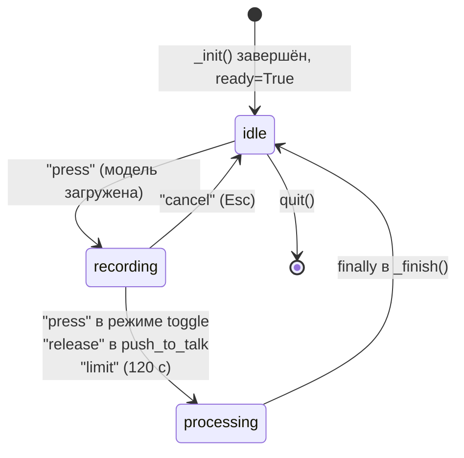
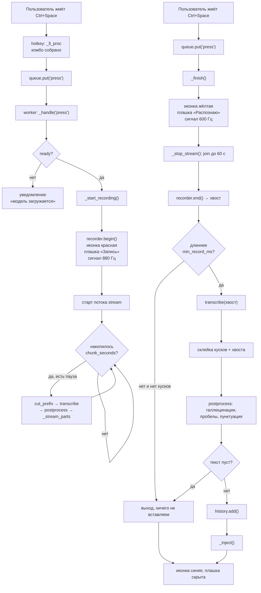
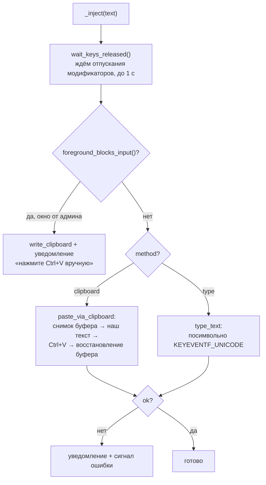

# 03. Рантайм-сценарии

Все сценарии описаны по коду [app.py](../whispertype/app.py). Читать этот документ лучше
с открытым файлом рядом.

## State machine приложения

`App.state` принимает три значения ([app.py:52](../whispertype/app.py)):



Отдельно от `state` живут два флага:

- **`App.ready`** — модель загружена и прогрета. До этого нажатие хоткея показывает
  уведомление «Модель ещё загружается» ([app.py:163](../whispertype/app.py)).
- **`App.enabled`** — переключатель «Включено» в меню трея. Когда `False`, все события хоткея
  игнорируются ([app.py:158](../whispertype/app.py)), а хук перестаёт отслеживать нажатия.

Состояние отражается в трёх местах одновременно: иконка трея (`tray.set_state`), экранная
плашка (`_overlay_show`/`_overlay_hide`) и звуковой сигнал (`sounds`).

## Сценарий 1. Запуск программы

[`main()`](../whispertype/app.py) → строки 409–426:

1. `ensure_dirs()` — создаёт `%APPDATA%\WhisperType` и `%LOCALAPPDATA%\WhisperType\{models,logs}`.
2. `load_config()` — читает `config.json`; при любой поломке возвращает дефолты и список
   предупреждений (см. [07-config-data.md](07-config-data.md)).
3. `setup_logging()` — файл `app.log` с ротацией; при запуске из исходников ещё и stderr.
4. `acquire_single_instance()` — если программа уже запущена, MessageBox и `return 0`.
5. `App(cfg)` — конструктор создаёт **все** подсистемы, но ничего не запускает.
6. `_install_excepthooks()` — необработанное исключение в любом потоке переводит иконку
   в состояние «ошибка» и пищит.
7. `app.run()` → `tray.run(setup=self._setup)` — блокирующий цикл pystray.

Дальше pystray в отдельном потоке вызывает `_setup` → `_init()`
([app.py:99](../whispertype/app.py)):

```
tray.set_state("loading")        иконка серая
history.load()                   читает history.json
recorder.start()                 открывает микрофон + watchdog
worker поток                     старт
foreground поток                 старт
listener.start()                 ставит клавиатурный хук
overlay.start()                  создаёт окно индикатора
если модель не скачана           уведомление «~1.6 ГБ, это займёт время»
transcriber.load()               ← долго: 1.6 ГБ с HuggingFace при первом запуске
transcriber.warm_up()            прогон 1 с тишины
ready = True; tray.set_state("idle")
```

**Важная деталь порядка:** хук и запись стартуют **до** загрузки модели. Поэтому хоткей
физически работает уже во время загрузки — но `ready == False`, и нажатие лишь показывает
уведомление. Так пользователь получает обратную связь вместо «программа не реагирует».

Если `_init()` бросит исключение, `_setup` его ловит: иконка становится тёмно-красной,
приходит уведомление, играет сигнал ошибки ([app.py:93-97](../whispertype/app.py)).

## Сценарий 2. Обычная диктовка (главный путь)



### Ключевые моменты этого потока

**Порядок в `_finish()` важен и был исправлен в 1.1.2.** Индикатор переключается на «Распознаю»
**до** `_stop_stream()` ([app.py:244-253](../whispertype/app.py)). Если сделать наоборот,
красная плашка «Запись» висит всё время, пока идёт `join` фонового куска (до 60 с), хотя
микрофон пользователь уже отпустил.

**`finally` гарантирует возврат в `idle`** ([app.py:280-283](../whispertype/app.py)) — даже
если распознавание бросит исключение, иконка и плашка вернутся в исходное состояние.
Само исключение поймает `_worker_loop` и переведёт иконку в «ошибка».

**Слишком короткая запись** (`< min_record_ms`, дефолт 300 мс) не распознаётся, но если
потоковые куски уже есть — они всё равно вставятся: хвост в этом случае считается обрывком
([app.py:256-260](../whispertype/app.py)).

## Сценарий 3. Потоковая нарезка длинной диктовки

Поток `stream` ([app.py:200-225](../whispertype/app.py)) работает, пока идёт запись:

```
каждые 0.25 с:
  накоплено < chunk_seconds (8 с)?  → ждём дальше
  иначе: cut_prefix(target=8 с, hard_max=25 с)
     ищем самую тихую точку в окне (find_cut_point)
     паузы нет и есть запас до 25 с? → возвращаем пустой массив, копим дальше
     иначе → отрезаем префикс по паузе
  transcribe(кусок) → postprocess → _stream_parts.append()
```

Смысл: к моменту отпускания хоткея почти всё уже распознано, остаётся короткий хвост. Поэтому
**ожидание не растёт вместе с длиной диктовки**.

Две тонкости, каждая из которых стоила отдельного бага:

1. **Режем только по настоящей паузе** ([audio.py:27-53](../whispertype/audio.py)). Разрез
   посреди слова задваивает его на стыке кусков. Функция `find_cut_point` ищет самый тихий
   фрейм, причём **с оглядкой назад** (`SEARCH_BACK_SECONDS = 6.0`), а не среди самых свежих
   данных.
2. **Жёсткий предел 25 с, а не 29** ([app.py:208](../whispertype/app.py), константа
   `MAX_NARROW_SECONDS` в [stt.py:35](../whispertype/stt.py)). Выше этой границы окно энкодера
   перестаёт сужаться, и кусок проваливается в дорогой полный проход — подробнее в
   [06-speed.md](06-speed.md).

Каждый кусок фильтруется от галлюцинаций **отдельно** ([app.py:222](../whispertype/app.py)):
обрывок на стыке легко порождает галлюцинацию, а в общей склейке её уже не отличить от речи.

## Сценарий 4. Вставка текста

`_inject()` ([app.py:293-310](../whispertype/app.py)):



**Зачем `wait_keys_released`** ([inject.py:119-131](../whispertype/inject.py)): если
пользователь ещё держит Ctrl, наш синтезированный Ctrl+V придёт в окно как
Ctrl+Ctrl+V — и вставки не будет.

**Почему UIPI проверяется заранее** ([inject.py:426-449](../whispertype/inject.py)): Windows
молча отбрасывает `SendInput` в окно процесса с более высоким integrity level. «Молча» — то
есть `SendInput` вернёт успех, а текст не появится. Поэтому уровень целостности сравнивается
до попытки, и пользователь получает внятное объяснение.

Подробности WinAPI — в [05-winapi.md](05-winapi.md).

## Сценарий 5. Вставка фразы из истории

Особый случай: в момент клика по пункту меню активным окном является **меню трея**, а не то
поле, куда пользователь хочет вставить текст.

`insert_phrase()` ([app.py:330-339](../whispertype/app.py)):

1. Смотрим текущее активное окно. Если это наше окно (меню) — берём `_last_window`.
2. `_last_window` пишет фоновый поток `_track_foreground` раз в 0.2 с, **пропуская** окна
   нашего процесса и окна оболочки Windows.
3. `focus_window()` возвращает фокус целевому окну и **ждёт подтверждения опросом** — потому
   что `SetForegroundWindow` асинхронен и вправе тихо отказать.
4. Не получилось — текст кладётся в буфер и приходит уведомление.

**Почему фильтруются окна оболочки** ([inject.py:359-370](../whispertype/inject.py)): пока
пользователь целится мышью в значок в трее, активным окном успевает побыть `Shell_TrayWnd`
(панель задач). Без фильтра история вставлялась бы в панель задач.

**Почему `focus_window` вообще работает**: Windows разрешает `SetForegroundWindow` только
процессу, который сам сейчас активен. Для меню трея это условие выполнено — pystray делает
своё окно активным перед показом меню и обратно фокус не отдаёт
([inject.py:408-414](../whispertype/inject.py), docstring).

## Сценарий 6. Отмена записи

Клавиша `Esc` во время записи ([hotkey.py:113-116](../whispertype/hotkey.py)):

- хук отправляет `"cancel"` и **возвращает `1`** — то есть Esc не доходит до активного
  приложения (иначе он закрыл бы диалог, в который пользователь диктует);
- `_cancel()` останавливает поток нарезки, выбрасывает накопленные куски и аудио, возвращает
  состояние в `idle` ([app.py:234-242](../whispertype/app.py)).

## Сценарий 7. Смерть и восстановление микрофона

Watchdog ([audio.py:204-212](../whispertype/audio.py)) раз в 3 с проверяет `stream.active`.
Если поток умер (пользователь выдернул USB-микрофон или сменил устройство в системе) —
переоткрывает.

`_open_stream` ([audio.py:169-192](../whispertype/audio.py)) пробует сначала настроенное
устройство, потом системное по умолчанию как fallback. Если не открылось ни одно —
`begin()` вернёт `False`, и пользователь получит уведомление «Микрофон недоступен».

## Сценарий 8. Завершение работы

`quit()` → `shutdown()` + `tray.stop()` ([app.py:120-133](../whispertype/app.py)):

```
_shutdown.set()          останавливает foreground-поток и worker
listener.stop()          PostThreadMessageW(WM_QUIT) в поток хука
overlay.stop()           PostMessageW(WM_APP_CLOSE)
recorder.close()         останавливает watchdog и закрывает поток
transcriber.unload()     отпускает модель
```

`shutdown()` идемпотентен (проверка `_shutdown.is_set()` в начале) — он вызывается и из
`quit()`, и из `finally` в `main()`.

## Проверь себя

1. Пользователь диктовал 40 секунд без единой паузы. Сколько кусков распознает поток `stream`
   и почему? *(Ответ: режет по достижении 25 с — `hard_max`, даже если паузы нет; см.
   `find_cut_point` и [app.py:208](../whispertype/app.py).)*
2. Что произойдёт, если нажать хоткей через секунду после старта программы?
   *(Ответ: `ready == False` → уведомление «Модель ещё загружается»; запись не начнётся.)*
3. Почему нельзя определить целевое окно для вставки из истории прямо в момент клика?
   *(Ответ: активным окном в этот момент является меню трея; нужен заранее сохранённый
   `_last_window`.)*
