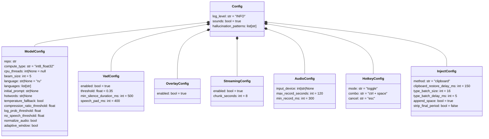
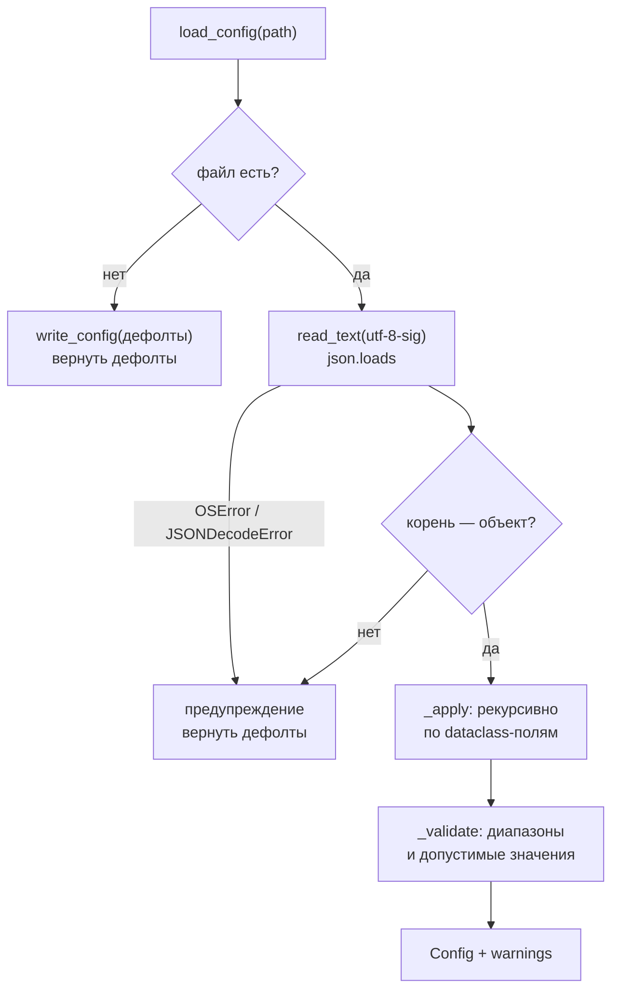

# 07. Конфигурация и файлы данных

## Что где лежит

```
%APPDATA%\WhisperType\
├── config.json      настройки пользователя
└── history.json     последние 10 фраз

%LOCALAPPDATA%\WhisperType\
├── models\          скачанная модель (~1.6 ГБ), кэш HuggingFace
└── logs\
    ├── app.log      текущий лог
    └── app.log.1…5  ротация, по 2 МБ
```

Пути вычисляются в [config.py:38-59](../whispertype/config.py), каталоги создаются на старте
через `ensure_dirs()`.

**Почему разные корни.** `APPDATA` (roaming) в доменных сетях перемещается вместе с профилем
пользователя — туда логично класть настройки. `LOCALAPPDATA` не перемещается, и 1.6 ГБ модели
плюс логи должны лежать именно там.

**Ни один из этих путей не трогается инсталлятором при удалении** — конфиг, история и модель
переживают переустановку. Проверено при выпуске релизов, см.
[08-build-release.md](08-build-release.md).

---

## Модель конфигурации

`config.json` — прямое JSON-отображение вложенных dataclass'ов из
[config.py](../whispertype/config.py):



Полная таблица параметров с описанием каждого — в
[README, раздел «Все параметры»](../README.md#все-параметры). Здесь не дублируется.

---

## Как читается конфиг

`load_config()` ([config.py:299-319](../whispertype/config.py)) построен так, чтобы
**никогда не падать**. Любая проблема → дефолт + предупреждение в списке, который потом
попадает в лог ([app.py:413-414](../whispertype/app.py)).



### Три уровня защиты

**1. Неизвестные ключи игнорируются.** `_apply` идёт по полям dataclass'а, а не по ключам
JSON ([config.py:230](../whispertype/config.py)). Опечатка в имени параметра не вызовет
ошибку — параметр просто останется дефолтным.

**2. Проверка типов.** Словарь `_FIELD_TYPES` ([config.py:184-219](../whispertype/config.py))
задаёт допустимые JSON-типы каждого листового поля. Отдельно обрабатывается `bool`:

```python
def _type_ok(name, value):
    expected = _FIELD_TYPES[name]
    if isinstance(value, bool) and bool not in expected:
        return False          # bool — подкласс int, без этой проверки
    return isinstance(value, expected)   # true прошло бы как cpu_threads
```

**3. Проверка диапазонов.** `_validate` ([config.py:249-296](../whispertype/config.py)):

| Параметр | Правило | При нарушении |
|---|---|---|
| `hotkey.mode` | `push_to_talk` / `toggle` | → `toggle` |
| `inject.method` | `clipboard` / `type` | → `clipboard` |
| `model.beam_size` | 1–5 | → 5 |
| `model.cpu_threads` | ≥ 1 или `null` | → `null` (автоподбор) |
| `vad.threshold` | 0.0–1.0 | → 0.35 |
| `streaming.chunk_seconds` | 5–25 | → 8 |
| `audio.max_record_seconds` | 1–600 | → 120 |
| `log_level` | DEBUG…CRITICAL | → INFO |
| `model.languages` | только строки | нестроковые отброшены |
| `hallucination_patterns` | только строки | нестроковые отброшены |

Верхняя граница `chunk_seconds` **связана с константой `stt.MAX_NARROW_SECONDS`**, но
проверяется литералом `25` с комментарием-отсылкой ([config.py:270-276](../whispertype/config.py)).
Это осознанный компромисс — иначе `config.py` пришлось бы импортировать `stt.py`, ломая
слоистость. Риск рассинхронизации отмечен в [10-tech-debt.md](10-tech-debt.md).

### BOM

```python
raw = json.loads(path.read_text(encoding="utf-8-sig"))   # config.py:310
```

`utf-8-sig`, а не `utf-8`: Блокнот Windows и PowerShell сохраняют файл с BOM, на которой
`json.loads` падает — и весь конфиг молча заменялся бы дефолтами. Это был реальный баг,
теперь закрыт тестом `test_config_with_utf8_bom_is_read`.

То же самое в [history.py:36](../whispertype/history.py).

---

## Как пишется конфиг

Два пути:

**1. Файла нет** → `write_config` с дефолтами при первом запуске. Пользователь сразу видит
полный набор параметров, а не пустой файл.

**2. Изменение из меню трея** → `App._persist` ([app.py:360-372](../whispertype/app.py)):

```python
apply(self.cfg)              # снимок в памяти
on_disk, _ = load_config()   # перечитать файл
apply(on_disk)               # применить туда же
write_config(on_disk)        # записать
```

Перечитывание обязательно: снимок в памяти сделан при запуске, и запись им целиком затёрла бы
правки, внесённые в `config.json` руками при работающей программе.

Формат записи — `indent=2`, `ensure_ascii=False` (кириллица читаемая), кодировка UTF-8
**без** BOM ([config.py:322-328](../whispertype/config.py)).

---

## `history.json`

Плоский список строк, свежие в конце файла (в меню показываются в обратном порядке):

```json
[
  "первая фраза",
  "вторая фраза"
]
```

Ограничение — `deque(maxlen=10)` ([history.py:13](../whispertype/history.py)).

Перезаписывается целиком при каждой добавленной фразе. Обоснование в docstring: файл
крошечный, а приложение закрывают как попало — копить в памяти до выхода значило бы терять
историю при снятии процесса через диспетчер задач.

Загрузка терпима ко всему: нет файла, битый JSON, BOM, не-список, нестроковые элементы →
пустая история и запись в лог, но не падение.

---

## Логи

Формат ([logging_setup.py:14-16](../whispertype/logging_setup.py)):

```
2026-08-04 15:11:02,431 INFO    [worker] whispertype.app: распознано 5.5 с аудио за 1.06 с: 'Привет...'
```

Имя потока в формате критично: при 9 потоках без него разобрать лог невозможно.

Ротация: `app.log`, 2 МБ, 5 бэкапов — то есть максимум 12 МБ.

Хендлер stderr добавляется **только если не `sys.frozen`** — в собранном GUI-приложении
консоли нет.

### Что искать в логе при разборе проблем

| Строка | О чём говорит |
|---|---|
| `загрузка модели ... threads=10 авто` | какие параметры реально применились |
| `не удалось прочитать config.json` | почти всегда BOM |
| `распознано N с аудио за M с` | производительность каждой записи |
| `промежуточный кусок N с` | работа потоковой нарезки |
| `узкое окно дало повтор — схлопнул` | сработало схлопывание самоповтора |
| `SetWindowsHookExW провалился` | хук не встал, хоткей не работает |
| `аудиопоток умер ... переоткрываю` | смена или отключение микрофона |
| `модификаторы всё ещё зажаты` | вставка может не сработать |

---

## Проверь себя

1. Пользователь написал `"cpu_threads": true` в конфиге. Что произойдёт?
   *(Ответ: `_type_ok` отвергнет — `bool` не в списке типов; останется `null`, будет
   предупреждение. Тест `test_wrong_type_keeps_default`.)*
2. Почему `_persist` перечитывает файл вместо записи снимка из памяти?
   *(Ответ: иначе затрутся ручные правки, сделанные при работающей программе.)*
3. Где лежит модель и почему не в `%APPDATA%`?
   *(Ответ: `%LOCALAPPDATA%\WhisperType\models` — roaming-профиль не должен таскать 1.6 ГБ
   по сети.)*
